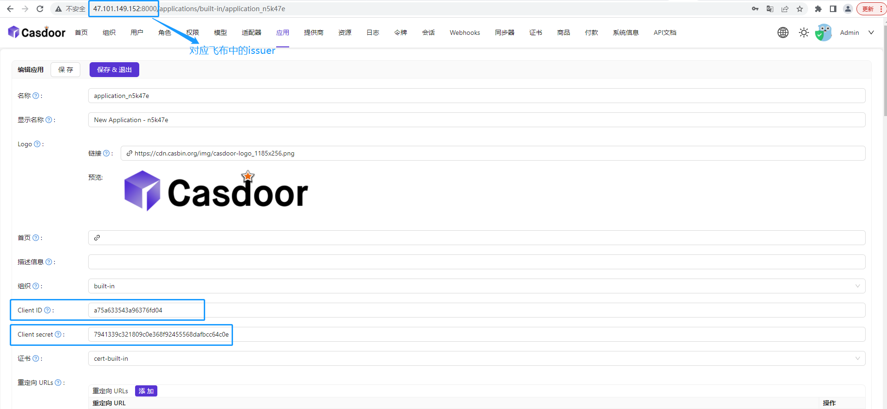

# 环境准备

## NodeJs

在 Fireboom 中使用 NodeJs 钩子时，你需要提前准备 NodeJs 环境。

* 如果你使用的是 Windows 系统，请前往[https://nodejs.org/en/download/](https://nodejs.org/en/download/)下载安装最新 NodeJs
* 如果你是 MacOs 或 Linux 系系统，建议使用 `nvm` 进行安装

```console
curl -o- https://raw.githubusercontent.com/nvm-sh/nvm/v0.39.3/install.sh | bash
export NVM_DIR="$([ -z "${XDG_CONFIG_HOME-}" ] && printf %s "${HOME}/.nvm" || printf %s "${XDG_CONFIG_HOME}/nvm")"
[ -s "$NVM_DIR/nvm.sh" ] && \. "$NVM_DIR/nvm.sh" # This loads nvm
nvm install stable
```

安装完成后使用命令检查

```console
# 尽量大于16
node -v
```

## 文件存储 S3

在 Fireboom 的最佳实践中，文件存储、读取、转换等工作应该全部交由 S3 来处理，Fireboom 支持所有兼容 S3 协议的服务，在使用前你需要先准备 S3 服务的配置，下面是常见的 S3 服务商的配置获取方法。

### 阿里云

进入阿里云官网[https://www.aliyun.com/](https://www.aliyun.com/)，登录成功后，打开控制台页面，在控制台页面-产品管理页，搜索对象存储，进入到对象存储页面

<figure><figcaption></figcaption></figure>

在存储桶列表页，进行创建存储桶操作

<figure><figcaption></figcaption></figure>

存储桶创建完成后，可在Bucket列表中点击对应的Bucket名称，即可获取存储桶名称、地域、地域节点信息

<figure><figcaption></figcaption></figure>

<figure><figcaption></figcaption></figure>

&#x20;

点击AccessKey管理，即可获取AccessKey ID和AccessKey Secret

<figure><figcaption></figcaption></figure>

<figure><figcaption></figcaption></figure>

在飞布文件存储模块，进行新增文件存储操作，将阿里云中获取的信息填写至对应的输入框中，保存完成即可

<figure><figcaption></figcaption></figure>

### 腾讯云

进入腾讯云官网[https://cloud.tencent.com/](https://cloud.tencent.com/)，登录成功后，打开控制台页面，在控制台页面-产品管理页，搜索对象存储，进入到对象存储页面

<figure><figcaption></figcaption></figure>

在存储桶列表页，进行创建存储桶操作

<figure><figcaption></figcaption></figure>

存储桶创建完成后，可在存储桶列表中点击对应的配置管理按钮，即可获取存储桶名称、所属地域、访问域名信息

<figure><figcaption></figcaption></figure>

<figure><figcaption></figcaption></figure>

&#x20;

点击秘钥管理-访问秘钥，即可获取SecretId和SecretKey

<figure><figcaption></figcaption></figure>

<figure><figcaption></figcaption></figure>

在飞布文件存储模块，进行新增文件存储操作，将腾讯云中获取的信息填写至对应的输入框中，保存完成即可

<figure><figcaption></figcaption></figure>

### AWS

进入亚马逊官网https://console.aws.amazon.com，登录成功后，打开控制台页面，搜索s3，进入到存储桶页面，进行创建存储桶操作

&#x20;

<figure><figcaption></figcaption></figure>

<figure><figcaption></figcaption></figure>

存储桶创建完成后，可在存储桶列表中点击对应的存储桶名称，即可获取存储桶名称、AWS区域信息

<figure><figcaption></figcaption></figure>

<figure><figcaption></figcaption></figure>

&#x20;

点击Security credentials入口，进行创建访问密钥操作

<figure><figcaption></figcaption></figure>

<figure><figcaption></figcaption></figure>

密钥创建成功后，获取访问密钥和秘密访问密钥

在飞布文件存储模块，进行新增文件存储操作，使用服务地址：s3.amazonaws.com以及获取的存储桶名称、AWS区域信息、访问密钥、秘密访问密钥进行创建，保存成功即可

<figure><figcaption></figcaption></figure>

### 自部署 minio

参考官方文档[https://min.io/download](https://min.io/download)完成安装，打开控制台页面，点击`Access Keys`，点击`Create access key`，创建一条新的认证配置信息，复制并粘贴到 Fireboom 中。&#x20;

<figure><figcaption></figcaption></figure>

<figure><figcaption></figcaption></figure>

服务地址一般为 `http://[minio-server].ip:9000` 区域在 minio 控制台，点击`Settings`，在默认`Region`面板右侧的`Server location`中填写并复制到 Fireboom中&#x20;

&#x20;

<figure><figcaption></figcaption></figure>

桶名称在 minio 控制台， 点击`Buckets`，点击`Create bucket`，根据提示完成创建&#x20;

<figure><figcaption></figcaption></figure>

## 身份认证 OIDC

在 Fireboom 的最佳实践中，用户登录、授权、校验、角色管理等都应该交由 OIDC 服务来处理，Fireboom 支持常见的一些 OIDC 服务商，在使用前你需要先准备好其中的一个或多个服务，下面是部分常见服务商的配置获取方法。

### Authing

进入Authing官网https://console.authing.cn/，在应用-自建应用页面，创建一个自建应用

<figure><figcaption></figcaption></figure>

查看已创建应用的配置信息

<figure><figcaption></figcaption></figure>

配置登录回调 URL：http://localhost:9991/auth/cookie/callback/authing（其中auth0可修改为其他）

<figure><figcaption></figcaption></figure>

在飞布身份验证模块，进行新增身份验证操作，将Authing中获取的信息填写至对应的输入框中，保存完成即可（新增页面的供应商ID对应登录回调地址中的authing）

<figure><figcaption></figcaption></figure>

&#x20;

### Auth0

进入Auth0官网https://manage.auth0.com/，在Applications页面选择或新建一个应用

<figure><figcaption></figcaption></figure>

&#x20;

查看已创建应用的配置信息

&#x20;

<figure><figcaption></figcaption></figure>

&#x20;

配置Allowed Callback URLs：http://localhost:9991/auth/cookie/callback/auth0（其中auth0可修改为其他）

&#x20;

<figure><figcaption></figcaption></figure>

在飞布身份验证模块，进行新增身份验证操作，将Auth0中获取的信息填写至对应的输入框中，保存完成即可（新增页面的供应商ID对应Allowed Callback URLs中的auth0）

<figure><figcaption></figcaption></figure>

### 自部署Casdoor

进入casdoor主页，点击应用入口，进行添加应用操作


在添加应用页面，可以对默认生成的名称等信息进行修改操作，Access Token格式需修改为JWT-Empty，完成注册项的配置后进行保存操作


查看已创建应用的配置信息



在飞布身份验证模块，进行新增身份验证操作，将Casdoor中获取的信息填写至对应的输入框中，保存完成即可（新增页面的供应商ID对应登录回调地址中的casdoortest）


在Casdoor中配置登录回调 URL：http://localhost:9991/auth/cookie/callback/casdoortest（其中casdoortest对应飞布中的供应商ID）


