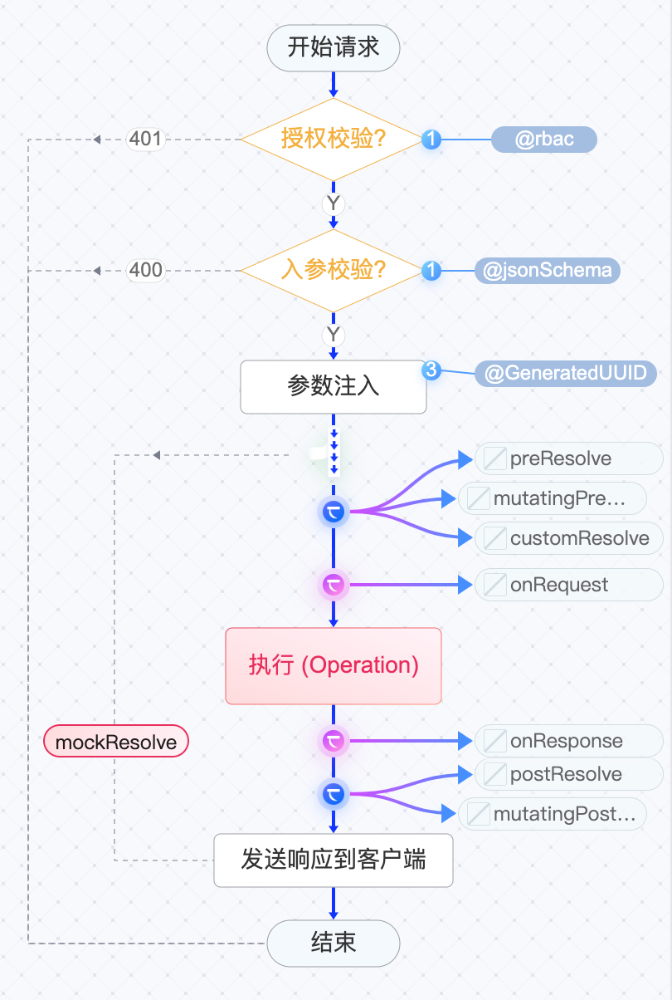

# API运行机制

飞布底层基于GraphQL构建，GraphQL OPERATION 分为三类，分别为：QUERY变更、MUTATION变更以及SUBSCRIPTION订阅。每种类型的OPERATION在编译为API时，有不同的表现。此外，使用特定指令修饰后，也会有不同表现，如 `@internalOperation` 指令。

接下来，我们分别进行介绍。

## HTTP流程图

飞布将 <mark style="color:red;">公开</mark> 的 QUERY 和 MUTATION OPERATION （不包括 SUBSCRIPTION ）转换为 REST API，供客户端直接调用，如浏览器等。

* 公开 QUERY OPERATION 对应 GET 请求。
* 公开  MUTATION OPERATION 对应 POST 请求。

其流程图如下所示：

### 流程讲解

首先，当客户端发起请求时，需要经过授权检验，检查用户是否登录，角色是否匹配。

然后，校验入参是否合理，如是否满足正则表达式等。

接着，注入参数，包括环境变量、当前时间、UUID、Claims等。

然后，执行OPERATION，去对应外部数据源获取数据，如数据库、REST API等。

最后，进行响应转换，拍平响应的结构体，并发送响应给客户端。

### 钩子讲解

同时，该流程图也展示了钩子的执行时机，及钩子启停状态。

该流程图涉及两类钩子：全局钩子和局部钩子。

全局钩子：所有API共用，主要用于在请求数据源前后的逻辑处理，包括：onRequest和onResponse。（<mark style="color:orange;">在代码逻辑中，根据数据源的不同执行不同逻辑！</mark>）

局部钩子：每个API独立编写和启用，包括前置：preResolve、mutatingPreResolve，后置：postResolve、mutatingPostResolve，模拟钩子 mockResolve以及自定义钩子customResolve。

详情请前往[钩子章节](../../jin-jie-gou-zi-ji-zhi/gou-zi-ji-zhi/)。

点击钩子开关，可启停钩子；点击钩子名称，可打开在线IDE。

系统将根据当前选择的钩子语言，打开不同的钩子。

## 内部调用流程图

<mark style="color:red;">内部</mark> 的 QUERY 和 MUTATION OPERATION （不包括 SUBSCRIPTION），不对外暴露 （客户端无法通过 REST API访问），而是通过飞布数据代理层 供钩子服务调用。

使用 @internalOperation 指令修饰的OPERATION为内部 OPERATION 。

其流程图如下所示：

在钩子服务中，可通过InternalClient对象访问飞布数据代理（data proxy）中的内部OPERATION。如图中②表示请求流程，③表示响应流程。


事实上，钩子服务不仅能调用内部OPERATION，还可以调用外部OPERATION。其唯一的区别就是，内部OPERATION无法编译为REST API供外部调用。


## 订阅流程图

飞布将 SUBSCRIPTION OPERATION 转换为[ 服务器推流 SSE](https://juejin.cn/post/6854573215516196878) 。客户端与服务端建立链接后，可以实时收到来自服务器的消息。


SUBSCRIPTION OPERATION不能被声明为内部。


其流程图如下所示：

<figure><figcaption>
订阅流程图
</figcaption></figure>

### 流程讲解

首先，当客户端订阅服务时①，飞布服务同步订阅事件源②。

然后，等待事件源推送消息给飞布服务③，飞布将其转发给客户端④。

最后，当客户端取消订阅时⑤，飞布也取消订阅⑥。

其中，③和④在取消订阅前，循环执行。

### 钩子讲解

同时，该流程图也展示了钩子的执行时机，及钩子启停状态。

该流程图涉及两类钩子：全局钩子和局部钩子。

全局钩子：所有API共用，主要用于在请求数据源前后的逻辑处理，包括：onConnection。（<mark style="color:orange;">在代码逻辑中，根据数据源的不同执行不同逻辑！</mark>）

局部钩子：每个API独立编写和启用，包括前置：preResolve、mutatingPreResolve，后置：postResolve、mutatingPostResolve。

详情请前往[钩子章节](../../jin-jie-gou-zi-ji-zhi/gou-zi-ji-zhi/)。
