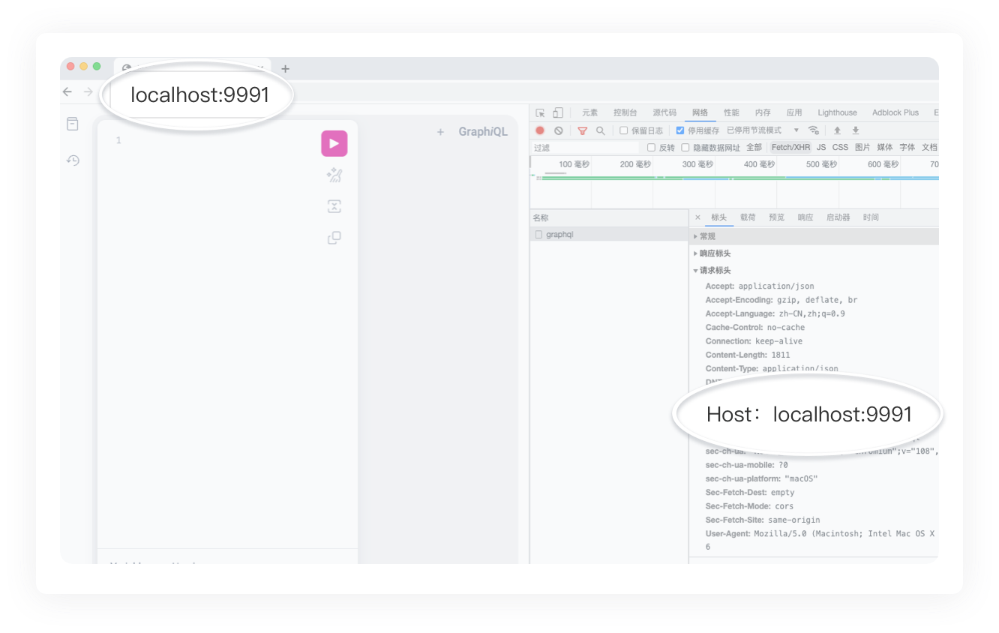

# 新建API

了解飞布的API规范后，接下来我们学习下如何新建一条API。

## 视频课程



## API管理面板

* API新建：点击右上角“+”、下方“新建”，可创建API
* API列表：展示所有API，不同状态说明如下
  * 方法：POST对应MUTATION，GET对应QUERY和SUBSCRIPTION
  * 实时：GET标识右上角的闪电符表示当前API为QUERY的实时查询或SUBSCRIPTION
  * 内部：API名称后的内部表示当前OPERATION仅供内部调用，不对外公开
  * 上线：未上线API用灰色表示表示
  * 非法：“非法”标识当前API的OPERATION有异常，无法正常使用
* 全局设置：应用于所有API的全局设置，主要包含授权配置、缓存配置、实时配置
* 批量新建：进入批量新建页，前往查看
* 端点测试：进入GraphQL测试页
* 批量操作：按住shift键多选API，右击可进行批量操作，包括上下线、删除等

## 超图Schema面板

该面板是超图Schema的可视化展示，主要包含如下功能：


05功能介绍-如何使用飞布超图面板构建API?


* 搜索：下拉选择命名空间，或输入函数名搜索所需方法
* 筛选：支持查询QUERY、变更MUTATION、订阅SUBSCRIPTION的筛选
* 勾选：展开对应方法，选择所需字段，并设置过滤条件
  * 选择字段：勾选方法下的蓝色字段，也可以展开折叠的蓝色字段，勾选嵌套字段
  * 过滤条件：勾选紫色字段，设置过滤条件
    * 默认值：在蓝色字段后的输入框中设置默认值
    * 函数入参：点击蓝色字段和输入框之间的`$`符，可以将过滤条件设置为函数入参


\_join字段的用法比较特殊，详情见下文“[跨源关联](broken-reference/)”


## 编辑器GraphQL

GraphQL编辑器主要用来查看、修改以及测试OPERATION，具体功能如下：

* 编辑：手动修改OPERATION，支持语法提醒和自动补全
* 输入：输入OPERATION的入参
  * 可视化输入：用表格的形式展示入参，提供类型校验，和录入组件，如日期录入
  * 源码输入：在源码视图输入JSON，支持语法校验和提醒
* 响应：以JSON形式展示请求结果


编辑器中指令无法生效，请输入参数模拟指令的入参


接下来，重点介绍下工具栏：

### 角色

可视化编写@rbac指令，降低使用门槛。包含四种匹配模式，我们以集合的概念进行讲解：

<mark style="color:red;">待配图</mark>

* requireMatchAll：全部匹配，用户角色包含API角色时，可访问
* requireMatchAny：任意匹配，用户角色与API角色有交集时，可访问
* denyMatchAll：非全部匹配，当任意匹配或互斥匹配时，可访问
* denyMatchAny：互斥匹配，用户角色与API角色互斥时，可访问

### 内部

设置OPERATION为内部方法，设置后不对外暴露，仅能用于钩子调用，详情见钩子

.png>)

### 入参指令

快速添加所有入参修饰符，主要包含两类：修饰参数和注入参数，后者由服务端注入，不允许客户端修改，详情见下文。

#### jsonSchema

修饰参数，用于实现入参校验，主要包含如下校验方式：

* 正则校验：正则表达式校验参数，用法`@jsonSchema(pattern: "这里是正则表达式")`
* 通用校验：使用内置的规则校验入参，包含EMAIL和DOMAIN，用法`@jsonSchema(`commonPattern`:` EMAIL`)`
* 长度校验：针对字符串，校验其长度`minLength`和`maxLength`
* 大小校验：针对数字，校验其大小`minimum`和`maximum`
* 数组校验：针对数组，校验数组的尺寸`minItems`和`maxItems`

#### fromClaim

注入参数，服务端注入登录用户的Claim字段，保证接口的数据权限，具体包含USERID、EMAIL、EMAIL\_VERIFIED、NAME、 NICKNAME、 LOCATION、 PROVIDER字段。

```
# 示例
@fromClaim(name: USERID)
```

#### injectGeneratedUUID

注入参数，服务端自动注入UUID，仅能修饰`string`字段。

#### injectCurrentDatetime

注入参数，服务端自动注入Datetime，仅能修饰`date`字段。包含两种使用方式：

* 内置格式：系统内置了多种日期规范，包括：

```graphql
# 示例
@injectCurrentDateTime(format: ISO8601)

# 其他格式枚举
  ISO8601：2006-01-02T15:04:05-0700
  ANSIC：Mon Jan _2 15:04:05 2006
  UnixDate：Mon Jan _2 15:04:05 MST 2006
  RubyDate：Mon Jan 02 15:04:05 -0700 2006
  RFC822：02 Jan 06 15:04 MST
  RFC822Z：02 Jan 06 15:04 -0700
  RFC850：Monday, 02-Jan-06 15:04:05 MST
  RFC1123：Mon, 02 Jan 2006 15:04:05 MST
  RFC1123Z：Mon, 02 Jan 2006 15:04:05 -0700
  RFC3339：2006-01-02T15:04:05Z07:00
  RFC3339Nano：2006-01-02T15:04:05.999999999Z07:00
  Kitchen：3:04PM
  Stamp：Jan _2 15:04:05
  StampMilli：Jan _2 15:04:05.000
  StampMicro：Jan _2 15:04:05.000000
  StampNano：Jan _2 15:04:05.000000000
```

* 自定义格式：采用符合golang规范的日期自定义格式，用法

```graphql
@injectCurrentDateTime(customFormat: "符合golang规范的日期")
```

#### injectEnvironmentVariable

注入参数，服务端自动注入环境变量。

#### hooksVariable

注入参数，设置后，允许在钩子中注入该参数，详情见钩子。

#### internal

特殊修饰符，与`_join`联合使用，实现跨源关联，详情见跨源关联。

## 概览面板

概览面板以可视化的形式展示当前OPERATION的运行机制，主要包括：

* 公开OPERATION：
  * HTTP流程：将被编译为API，并根据修饰符实时变化，如登录校验和入参校验，其核心是“执行OPERATION”
  * 钩子展示：展示钩子在HTTP流程中的注入切面，以及钩子是否开启



* 内部OPERATION：不对外暴露，仅供钩子调用

.png>)

## 设置面板

与全局设置对应，启用独立配置后，可对当前OPERATION单独设置。

* 开启授权：设置当前OPERATION的权限，开启后用户登录才能访问
* 缓存配置：仅对QUERY生效
  * 查询缓存：开启后启用缓存，提升服务性能
  * 最大时长：缓存有效时长，过期后，缓存失效
  * 重校验时长：缓存的客户端重校验时长
* 实时配置：仅对QUERY生效
  * 实时查询：开启后服务器轮询生效，可定时将消息推送至客户端
  * 轮询间隔：服务器轮询间隔，越短响应越快

## 钩子面板

将概览面板中的钩子单独提取出来，钩子简化展示。

## API工具栏

编辑器顶部是API工具栏，主要功能如下：

* 重命名：重命名API
* 状态：展示当前OPERATION是否被保存
* 克隆：克隆当前OPERATION，包括钩子
* 复制：复制当前OPERATION的API地址，若开启实时，则会带上实时后缀
* 保存：保存当前OPEARTION
* 开关：上下线当前OPERATION
