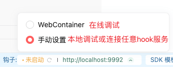

# Golang钩子

本文将重点介绍，飞布内置的Go 钩子如何使用。

开发钩子的过程和开发Go 服务是一样的，你都需要准备开发环境。

## 快速操作

### 钩子编写

#### 在线编写

参考Node钩子

#### IDE编写

由于钩子服务本身是一个完整可启动的项目，因此在通过上一节创建钩子后，可以直接在本地找到 custom-go 文件夹，使用任意 IDE 或编辑器打开钩子项目进行编辑。

### 钩子调试

钩子服务本地启动，可以配置钩子服务器地址，默认是localhost:9992，如果将钩子服务移动到其他地址，可以在钩子面板中修改。

&#x20;

#### IDE 调试

在 IDE 中打开custom-go文件夹执行以下脚本启动钩子服务器。也可以通过调试器启动，以实现断点调试功能。

```go
go mod tidy
go run main.go
```

## 函数签名

所以钩子函数入参一个是hook对象，包含以下参数中的全部或一部分。

* clientRequest: 客户端请求对象，包含请求头、请求体、请求参数等信息
* internalClient: 内部客户端，可以通过此客户端发起内部请求，或操作数据库等
* user: 用户信息
* logger: 日志对象

另一个是body对象，包含以下参数中的全部或一部分。

* input: 输入参数
* response: 响应对象

### postAuthentication

用户身份验证后，会调用此函数，可以在此函数中进行用户信息存储或打印日志等操作。

#### 函数签名

```go
func PostAuthentication(hook *base.AuthenticationHookRequest) error
```

### mutatingPostAuthentication

用户身份验证后，会调用此函数，可以在此函数中手动控制用户身份验证结果，返回 ok 表示验证通过，deny 表示验证失败。 验证通过时，可以修改返回的user对象，如果不需要修改，则直接返回入参的user即可。

#### 函数签名

```go
func MutatingPostAuthentication(hook *base.AuthenticationHookRequest) (*plugins.AuthenticationResponse, error)
```

### revalidate

重新验证用户身份，当用户身份信息或权限等变更时，可以触发此钩子，用于更新相关数据。返回内容同 mutatingPostAuthentication

#### 函数签名

```ts
({ clientRequest, internalRequest, user, log }) => Promise<void>
```

### postLogout

用户登出时触发，可以在此钩子中清理用户登录信息，如删除外部session等。

#### 函数签名

```ts
({ clientRequest, internalRequest, user, log }) => Promise<void>
```

### onRequest

请求到达时触发，可以在此钩子中对请求进行预处理，如修改请求头、请求体等。返回值为修改后的请求对象。

#### 函数签名

```ts
({ clientRequest, internalRequest, user, log, input }) => Promise<clientRequest>
```

### preResolve

该钩子在请求到达后，api执行前触发，此处不能修改请求信息，通常可以在此处做日志记录。

#### 函数签名

```ts
({ clientRequest, internalRequest, user, log, input }) => Promise<void>
```

### mutatingPreResolve

该钩子在请求到达后，api执行前触发，该接口可以修改请求入参。

#### 函数签名

```ts
({ clientRequest, internalRequest, user, log, input }) => Promise<input>
```

### postResolve

该钩子在api执行后触发，此处不能修改请求信息，通常可以在此处做日志记录，或触发其他额外操作。

#### 函数签名

```ts
({ clientRequest, internalRequest, user, log, input, response }) => Promise<void>
```

### mutatingPostResolve

该钩子在api执行后触发，该接口可以修改响应内容。

#### 函数签名

```ts
({ clientRequest, internalRequest, user, log, input, response }) => Promise<response>
```

### customResolve

该钩子在api执行前触发，你可以在该接口中覆盖 api 的执行逻辑。当该接口返回 void 或 null 时，将正常执行api，否则将跳过执行直接返回该接口的返回值。 您可以在该接口中实现自定义权限或其他数据校验逻辑，用以控制api的执行。

#### 函数签名

```ts
({ clientRequest, internalRequest, user, log, input }) => Promise<response>
```

### mockResolve

该钩子用于实现mock功能, 用于在开发阶段模拟api的返回结果，以便于前端开发人员进行开发。

#### 函数签名

```ts
({ clientRequest, internalRequest, user, log, input }) => Promise<response>
```
