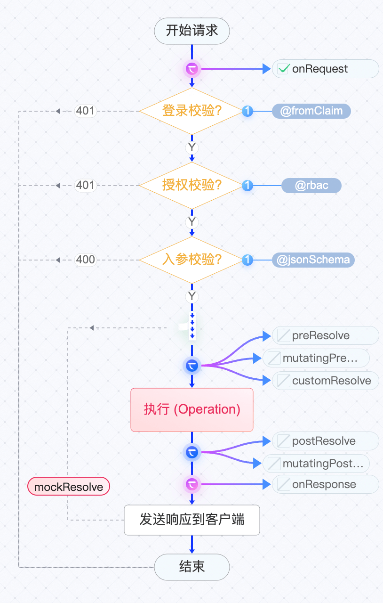

# 钩子规范

钩子服务本质上是一个实现了飞布钩子规范的WEB服务，可以用任意后端语言实现。

当前飞布已经支持了 TypeScript 语法的 NodeJs 钩子，下一步计划实现golang语言的钩子SDK。

如果你希望实现自己的 hook SDK，需要遵从如下协议。

1. 生成一个自己的入口文件，ts 版本为 `fireboom.server.ts`，参考 ts 的实现生成`authentication` `queries` `mutations` `global`等钩子的引用和其它必要配置
2. 根据环境变量`START_HOOKS_SERVER`决定是否启动钩子服务
3. 提供一个 SDK 给上述入口文件使用，接受上述配置，启动API服务器
4. 读取`{WG_ABS_DIR}/generated/wundergraph.config.json`中的配置文件
5. 可以启动一个 HTTP 服务，监听`serverOptions.listen.host + serverOptions.listen.port`
6. 提供`/health`路由，返回200状态，响应体为 json `{"status":"ok"}`，用于健康检查
7. 提供`/`路由（非必需），返回可用于 Stackblitz 调试的 html 页面
8. 可引入、读取自定义数据源定义的函数，并生成`/gqls/{自定义数据源名称}/graphql`路由，该路由 GET 方法返回 GraphQL 调试页面， POST 方法接受 GraphQL 查询语句并返回结果，是一个标准的 GraphQL 服务端点。
9. 可引入、读取所有 Fireboom Operation 的钩子函数，并根据不同的钩子生成不同的路由，具体见下
10. 可引入、读取所有 Fireboom 组合式 Operation 定义，生成`/functions/${operation.api_mount_path}`路由，该路由支持 POST 方法，该路由应该根据组合式 Operation 的定义执行并返回 200 状态，响应体为 json `{"response":{"data":"具体返回的数据结构"}}`
11. 应该提供中间件服务来为请求注入包含`user log internalClient`的上下文（后面统称 ctx），同时钩子/组合式 Operation 在执行的函数里都应该能获取到同样的上下文，[参考](gou-zi-gui-fan.md#nodejs-上下文参考)
12. 生产环境（根据环境变量）优雅关闭

## API 和钩子执行流程图



## OPERATION 钩子

为扩展 Operation 的能力而设计的钩子，主要用于定制请求 Operation API 的行为。

| 路径                                             | 入参                                                                 | 成功出参                                                                                                                              | 失败出参                                                      | 说明                                                                         |
| ---------------------------------------------- | ------------------------------------------------------------------ | --------------------------------------------------------------------------------------------------------------------------------- | --------------------------------------------------------- | -------------------------------------------------------------------------- |
| /authentication/postAuthentication             | ctx                                                                | { hook: 'postAuthentication' }                                                                                                    | { hook: 'postAuthentication', error }                     | OIDC流程用户登录成功后，执行该钩子，不可修改user对象，成功200，失败500，下同                              |
| /authentication/mutatingPostAuthentication     | ctx                                                                | { hook: 'postAuthentication', response: 函数返回值, setClientRequestHeaders: 参考flattenHeaders }                                        | { hook: 'postAuthentication', error }                     | OIDC流程用户登录成功后，执行该钩子。主要用于修改登录对象user的值，实现特定逻辑，如绑定用户角色                        |
| /authentication/revalidateAuthentication       | ctx                                                                | { hook: 'revalidateAuthentication', response: ret, setClientRequestHeaders: 参考flattenHeaders }                                    | { hook: 'revalidateAuthentication', error }               | 重校验钩子                                                                      |
| /global/httpTransport/onOriginRequest          | -                                                                  | -                                                                                                                                 | -                                                         | 全局钩子 - 前置拦截                                                                |
| /global/httpTransport/onOriginResponse         | -                                                                  | -                                                                                                                                 | -                                                         | 全局钩子 - 后置拦截                                                                |
| /global/wsTransport/onConnectionInit           | -                                                                  | -                                                                                                                                 | -                                                         | subscription 钩子， 需根据 `config.global?.wsTransport?.onConnectionInit` 判断是否开启 |
| /operation/{operationName}/mockResolve         | { ...ctx, input: req.body.input }                                  | { op: operationName, hook: 'mock', response: ret, setClientRequestHeaders: request.ctx.clientRequest.headers }                    | { op: operationName, hook: 'mock', error }                | 模拟钩子，直接返回模拟数据而不经过其它流程                                                      |
| /operation/{operationName}/preResolve          | { ...ctx, input: req.body.input }                                  | { op: operationName, hook: 'preResolve', setClientRequestHeaders: request.ctx.clientRequest.headers }                             | { op: operationName, hook: 'preResolve', error }          | 前置钩子，operation 处理前执行                                                       |
| /operation/{operationName}/postResolve         | { ...ctx, input: req.body.input, response: request.body.response } | { op: operationName, hook: 'postResolve', setClientRequestHeaders: request.ctx.clientRequest.headers }                            | { op: operationName, hook: 'postResolve', error }         | 后置钩子，operation 处理后执行                                                       |
| /operation/{operationName}/mutatingPreResolve  | { ...ctx, input: req.body.input }                                  | { op: operationName, hook: 'mutatingPreResolve', input: ret, setClientRequestHeaders: request.ctx.clientRequest.headers }         | { op: operationName, hook: 'mutatingPreResolve', error }  | 前置可修改钩子，可以修改 request 入参                                                    |
| /operation/{operationName}/mutatingPostResolve | { ...ctx, input: req.body.input, response: request.body.response } | { op: operationName, hook: 'mutatingPostResolve', response: ret, setClientRequestHeaders: request.ctx.clientRequest.headers }     | { op: operationName, hook: 'mutatingPostResolve', error } | 后置可修改钩子，可以修改返回的response                                                    |
| /operation/{operationName}/customResolve       | { ...ctx, input: req.body.input }                                  | { op: operationName, hook: 'customResolve', response: ret \|\| null, setClientRequestHeaders: request.ctx.clientRequest.headers } | { op: operationName, hook: 'customResolve', error }       | 自定义处理钩子，如果该钩子有返回值，那么将跳过后续的流程，直接返回 response，否则继续执行后续流程                      |

其中`{operationName}`为`api.operations`遍历时的`operation.name`

### NodeJs 上下文参考

```ts
req.ctx = {
  log: pino({
    level: process.env.WG_DEBUG_MODE === 'true'
			? PinoLogLevel.Debug
			: process.env.WG_CLI_LOG_LEVEL
			? resolvePinoLogLevel(process.env.WG_CLI_LOG_LEVEL)
			: PinoLogLevel.Info
  }),
  user: req.body.__wg.user!,
  // clientRequest represents the original client request that was sent initially to the WunderNode.
  clientRequest: {
    headers: new Headers(req.body.__wg.clientRequest?.headers),
    requestURI: req.body.__wg.clientRequest?.requestURI || '',
    method: req.body.__wg.clientRequest?.method || 'GET',
  },
  internalClient: clientFactory({ 'x-request-id': req.id }, req.body.__wg.clientRequest),
}
```

### NodeJs 源码参考

参考[ NodeJs 钩子](node-gou-zi.md)实现其它语言的钩子服务。
